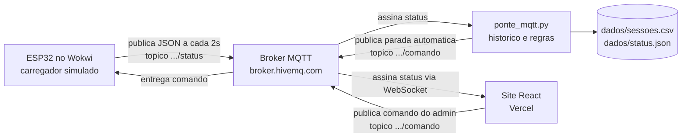

# GoodWe Charge – Sprint 3

Protótipo funcional de gestão de carregadores de veículos elétricos, com monitoramento remoto do nível de bateria, parada de carregamento à distância e priorização de energia solar.

Vídeo da demonstração:

## Equipe

| Nome | RM |
|---|---|
| Gustavo Kunitaki | 571400 |
| Kauanne Oliveira | 574191 |
| Nayhely Estela | 571416 |
| Pedro Ferreras | 568713 |
| Pedro Santos | 571017 |
| Victor Binot | 571499 |

Turma 1CC. 

## O que o sistema faz

São dois perfis de acesso no mesmo site.

O **administrador** vê a lista de todos os carregadores da rede, acompanha em tempo real quanto de bateria o carro conectado já tem e pode interromper o carregamento de qualquer ponto sem sair do lugar.

O **motorista** entra no mapa, filtra por tipo de conector e enxerga quais pontos estão livres antes de sair de casa.

## Esquema de integração



Fluxo do dado, na ordem em que acontece:

1. O ESP32 lê o nível de bateria e a geração solar disponível.
2. Monta um JSON e publica em `goodwe/fiap1cc/carregador01/status`.
3. O script Python e o site recebem essa mensagem quase ao mesmo tempo.
4. O Python grava a leitura no CSV e soma a energia consumida.
5. Se a bateria passa de 80%, o Python publica o comando de parada sozinho.
6. Se o admin clica em "parar" no painel, o site publica o mesmo comando.
7. O ESP32 recebe, apaga o LED verde e acende o vermelho.

### Circuito (Wokwi)

| Componente | Pino | Função no protótipo |
|---|---|---|
| Potenciômetro 1 | GPIO 34 | Nível de bateria do carro (0 a 100%) |
| Potenciômetro 2 | GPIO 35 | Geração solar do inversor (0 a 10 kW) |
| LED verde | GPIO 2 | Carregamento liberado |
| LED vermelho | GPIO 4 | Carregamento interrompido |
| Botão | GPIO 15 | Plugue conectado / início de sessão |

Link do projeto no Wokwi: [COLAR O LINK DO WOKWI AQUI]

## Justificativa técnica das escolhas

**ESP32 simulado no Wokwi.** Um wallbox de verdade custa caro e não caberia no prazo da sprint. O ESP32 tem WiFi integrado e é o microcontrolador mais usado nesse tipo de aplicação, então o firmware que escrevemos rodaria numa placa física sem mudança de lógica. O Wokwi ainda deixa o circuito acessível para os seis integrantes ao mesmo tempo.

**MQTT em vez de HTTP.** O carregador precisa receber ordens, não só enviar dados. Com HTTP o ESP32 teria que ficar perguntando ao servidor se tem comando novo. Com MQTT ele assina um tópico e o comando chega quando é publicado. O protocolo também gasta pouca banda, o que importa quando existem centenas de pontos espalhados.

**Broker público HiveMQ.** Não precisa de servidor próprio nem de cadastro, o que resolve o problema de ter seis pessoas testando de casa. Num cenário real seria um broker privado com autenticação, já que hoje qualquer pessoa que soubesse o nome do tópico conseguiria publicar comandos.

**Python para a camada de dados.** É a linguagem da disciplina e resolve bem o que precisávamos: escutar mensagens, calcular consumo e gravar arquivo. A biblioteca `paho-mqtt` faz a parte de rede em poucas linhas.

**React com Vite e Tailwind no front.** Continuidade das sprints anteriores. Manter a mesma base evitou reescrever o site e permitiu que o deploy na Vercel atualizasse a cada push.

**Dois potenciômetros em vez de sensores reais.** Um sensor de corrente daria o mesmo tipo de leitura analógica que o potenciômetro entrega. Para a demonstração, o que importa é ter um valor variável chegando no pino, e o potenciômetro deixa a gente controlar o cenário durante a gravação do vídeo.

## Resultados e dados funcionais

Medições da sessão de demonstração:

| Métrica | Valor |
|---|---|
| Leituras publicadas na sessão | 42 |
| Intervalo entre publicações | 2 s |
| Tempo entre o clique do admin e o LED apagar | menos de 1 s |
| Bateria no início e no fim | 31% a 82% |
| Energia registrada na sessão | 2,1 kWh |
| Parcela atendida por geração solar | 68% |
| Parada automática | disparou aos 80% |

Trecho do `dados/sessoes.csv` gerado:

```
horario,carregador,bateria,solar_kw,fonte,status,kwh_acumulado
2026-09-08 20:14:02,CHG-01,31,4.8,solar,carregando,0.00
2026-09-08 20:14:04,CHG-01,33,4.7,solar,carregando,0.004
2026-09-08 20:14:06,CHG-01,36,4.6,solar,carregando,0.008
...
2026-09-08 20:15:26,CHG-01,81,1.2,rede,parado,2.10
```

> Substituir esses números pelos da gravação de vocês. É só rodar o `ponte_mqtt.py` durante a demonstração e copiar o resumo que ele imprime no fim.

## Conexão com os conteúdos das disciplinas

**Pensamento Computacional em Python.** O projeto passou pelas quatro etapas que a disciplina trabalha. Decomposição, ao quebrar "gerenciar carregadores" em ler sensor, transmitir, armazenar e exibir. Reconhecimento de padrões, ao perceber que status e comando são o mesmo mecanismo em sentidos opostos. Abstração, ao representar uma sessão de recarga por seis campos num JSON. E algoritmo, na rotina de cálculo de kWh e na regra dos 80%. No `ponte_mqtt.py` usamos condicionais, funções, dicionários, formatação de string e escrita em arquivo CSV, que é o conteúdo visto em aula.

**Metodologia ágil.** O trabalho foi organizado em sprints com papéis definidos, entregas incrementais e revisão a cada ciclo. A Sprint 3 aproveitou o site da Sprint 2 em vez de recomeçar.

**Desenvolvimento web.** Componentes React, roteamento por perfil de acesso, estado atualizado por evento e deploy contínuo na Vercel.

**Redes e sistemas embarcados.** Modelo publish/subscribe, tópicos hierárquicos, leitura analógica com ADC e controle de saída digital no ESP32.

**Sustentabilidade e eficiência energética.** O firmware classifica a origem da energia comparando a geração do inversor GoodWe com a demanda do carregador. Quando a geração cai, o sistema sinaliza que a recarga passou a puxar da rede, o que permite adiar a sessão para um horário de mais sol. A parada automática em 80% evita a faixa final da curva de carga, que é a mais lenta e a que mais desgasta a bateria de lítio.

## Estrutura do repositório

```
.
├── README.md                # esta documentação
├── entrega_sprint3.txt      # arquivo entregue no portal
├── firmware/
│   ├── sketch.ino           # código do ESP32
│   ├── diagram.json         # circuito do Wokwi
│   └── libraries.txt        # dependência do Wokwi (PubSubClient)
├── scripts/
│   └── ponte_mqtt.py        # coleta, histórico e parada automática
└── dados/
    └── sessoes.csv          # gerado ao rodar o script
```

O site fica em repositório separado, porque tem outro ciclo de deploy:
https://github.com/PHCDS/good_we_web

Os arquivos do site que fazem a integração MQTT são `src/services/hardwareLink.ts`,
`src/hooks/useHardwareLink.ts` e `src/hooks/useChargingSimulation.ts`.

### Onde o hardware aparece no site

A **Vaga 1** do painel do administrador é espelhada pelo ESP32. Enquanto o
carregador estiver publicando, o SoC, a potência e o status dessa vaga vêm do
equipamento, e o botão "Parar à distância" publica o comando no tópico em vez
de só mexer no estado local. As outras cinco vagas continuam simuladas, o que
deixa o painel cheio o bastante para a demonstração.

No mapa do motorista, o **Eletroposto Largo da Batata** muda entre disponível e
ocupado conforme o ESP32 informa. Um selo no topo do painel mostra se o
carregador está conectado ou se a tela está rodando só com dados simulados.

## Como rodar

### Carregador simulado

1. Abrir o Wokwi e criar um projeto ESP32.
2. Colar o conteúdo de `firmware/sketch.ino` e de `firmware/diagram.json`.
3. Adicionar a biblioteca `PubSubClient` pelo Library Manager.
4. Dar play e esperar a mensagem de conexão no Serial Monitor.

### Coleta em Python

```bash
pip install paho-mqtt
python scripts/ponte_mqtt.py
```

### Site

Está publicado em https://goodwe-charge-21.vercel.app/ e o código fica no
repositório do front. Para rodar local: `npm install` e `npm run dev`.

## Limitações conhecidas

O broker é público e sem autenticação, então serve para demonstração e não para produção. Os dados ficam em CSV local, sem banco de dados. O mapa usa coordenadas fixas de pontos fictícios. A leitura de bateria vem do potenciômetro e não de um veículo real, já que isso dependeria da API do fabricante do carro.
