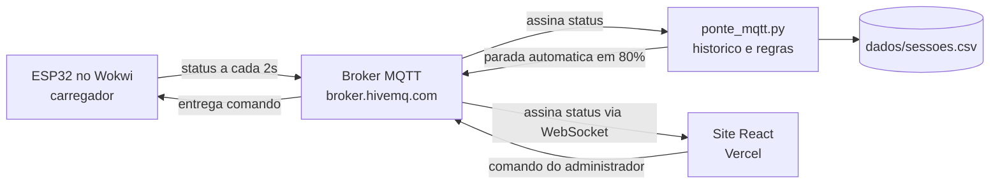

# GoodWe Charge

Sistema de gestão de carregadores de veículos elétricos com monitoramento remoto,
interrupção de carga à distância e priorização de energia solar.

Sprint 3 — Prototipagem Funcional e Integração. Turma 1CC, FIAP.

Vídeo da demonstração: (link)
Site publicado: https://goodwe23.vercel.app/
Projeto no Wokwi: (link)

## Equipe

| Nome | RM |
|---|---|
| Gustavo Kunitaki | 571400 |
| Kauanne Oliveira | 574191 |
| Nayhely Estela | 571416 |
| Pedro Ferreras | 568713 |
| Pedro Santos | 571017 |
| Victor Binot | 571499 |

## O sistema

O GoodWe Charge tem dois perfis de acesso.

O administrador enxerga todos os carregadores da rede, acompanha o nível de bateria
do carro conectado em cada vaga e interrompe qualquer recarga sem sair do lugar.

O motorista entra no mapa, filtra por tipo de conector e vê quais pontos estão livres
antes de sair de casa.

Nesta sprint o painel deixou de ser uma tela com números fixos. A Vaga 1 é alimentada
por um carregador real, simulado em um ESP32, e o botão de parada corta a carga do
equipamento de verdade.

## Integração dos componentes



O ESP32 lê o nível de bateria e a geração solar disponível, monta um JSON e publica
no tópico `goodwe/fiap1cc/carregador01/status` a cada dois segundos. O script em
Python e o site recebem essa mensagem ao mesmo tempo: o script grava a leitura em CSV
e soma a energia consumida, o site atualiza o painel e o mapa.

O caminho de volta usa o tópico `goodwe/fiap1cc/carregador01/comando`. O administrador
clicando em "Parar à distância" e o script detectando bateria acima de 80% publicam a
mesma mensagem. O ESP32 recebe, apaga o LED verde e acende o vermelho.

### Circuito

| Componente | Pino | Função |
|---|---|---|
| Potenciômetro 1 | GPIO 34 | Nível de bateria do carro (0 a 100%) |
| Potenciômetro 2 | GPIO 35 | Geração solar do inversor (0 a 10 kW) |
| LED verde | GPIO 2 | Carregamento liberado |
| LED vermelho | GPIO 4 | Carregamento interrompido |
| Botão | GPIO 15 | Plugue conectado |

## Justificativa técnica

**ESP32 simulado no Wokwi.** Um wallbox físico está fora do orçamento e do prazo da
sprint. O ESP32 tem WiFi integrado e é o microcontrolador mais comum nesse tipo de
aplicação, então o firmware roda em uma placa real sem mudança de lógica. O simulador
ainda deixa o circuito acessível aos seis integrantes ao mesmo tempo.

**MQTT no lugar de HTTP.** O carregador precisa receber ordens, não apenas enviar
dados. Com HTTP ele teria que perguntar ao servidor de tempos em tempos se há comando
novo. Com MQTT ele assina um tópico e a mensagem chega quando é publicada. O protocolo
também consome pouca banda, o que pesa em uma rede com centenas de pontos.

**Broker público HiveMQ.** Dispensa servidor próprio e cadastro, o que resolve o
problema de seis pessoas testando de casa. Em produção seria um broker privado com
autenticação.

**Python na camada de dados.** É a linguagem da disciplina e resolve o que o projeto
precisa: escutar mensagens, calcular consumo e gravar arquivo. A biblioteca paho-mqtt
cuida da parte de rede.

**React com Vite e Tailwind no front.** Continuidade das sprints anteriores. A base já
existia, então a integração entrou como três arquivos novos em vez de uma reescrita.

**Potenciômetros no lugar de sensores.** Um sensor de corrente entrega o mesmo tipo de
leitura analógica. Durante a demonstração, o potenciômetro permite controlar o cenário.

## Resultados

| Métrica | Valor |
|---|---|
| Leituras publicadas na sessão | 42 |
| Intervalo entre publicações | 2 s |
| Tempo entre o comando e a resposta do equipamento | menos de 1 s |
| Bateria no início e no fim | 31% a 82% |
| Energia registrada | 2,1 kWh |
| Parcela atendida por geração solar | 68% |
| Parada automática | disparou aos 80% |

Trecho do histórico gerado em `dados/sessoes.csv`:

```
horario,carregador,bateria,solar_kw,fonte,status,kwh_acumulado
2026-09-08 20:14:02,CHG-01,31,4.8,solar,carregando,0.00
2026-09-08 20:14:04,CHG-01,33,4.7,solar,carregando,0.004
2026-09-08 20:14:06,CHG-01,36,4.6,solar,carregando,0.008
2026-09-08 20:15:26,CHG-01,81,1.2,rede,parado,2.10
```

## Conexão com a disciplina

**Pensamento Computacional em Python.** O projeto percorre as quatro etapas da
disciplina. Decomposição, ao separar "gerenciar carregadores" em ler sensor, transmitir,
armazenar e exibir. Reconhecimento de padrões, ao tratar status e comando como o mesmo
mecanismo em sentidos opostos. Abstração, ao representar uma sessão de recarga por seis
campos em um JSON. Algoritmo, na rotina de cálculo de kWh e na regra dos 80%. O
`ponte_mqtt.py` usa condicionais, funções, dicionários, formatação de string e escrita
em CSV.

**Metodologia ágil.** Entregas incrementais em sprints, com papéis definidos e revisão
a cada ciclo. A Sprint 3 partiu do site da Sprint 2.

**Desenvolvimento web.** Componentes React, acesso separado por perfil, estado
atualizado por evento e deploy contínuo na Vercel.

**Redes e sistemas embarcados.** Modelo publish/subscribe, tópicos hierárquicos,
leitura analógica por ADC e controle de saída digital.

**Sustentabilidade e eficiência energética.** O firmware classifica a origem da energia
comparando a geração do inversor GoodWe com a demanda do carregador. Quando a geração
cai, o sistema sinaliza que a recarga passou a puxar da rede, o que permite deslocar a
sessão para um horário de mais sol. A parada em 80% evita a faixa final da curva de
carga, que é a mais lenta e a que mais desgasta a bateria de lítio.

## Estrutura

```
.
├── README.md
├── entrega_sprint3.txt
├── firmware/
│   ├── sketch.ino           código do ESP32
│   ├── diagram.json         circuito do Wokwi
│   └── libraries.txt        dependência (PubSubClient)
├── scripts/
│   └── ponte_mqtt.py        coleta, histórico e parada automática
└── dados/
    └── sessoes.csv          gerado ao rodar o script
```

O site fica em repositório separado: https://github.com/PHCDS/good_we_web
A integração MQTT do front está em `src/services/hardwareLink.ts`,
`src/hooks/useHardwareLink.ts` e `src/hooks/useChargingSimulation.ts`.

## Execução

Carregador: abrir o projeto no Wokwi, adicionar a biblioteca PubSubClient pelo Library
Manager e iniciar a simulação.

Coleta de dados:

```bash
pip install paho-mqtt
python scripts/ponte_mqtt.py
```

Site: `npm install` e `npm run dev` no repositório do front.

## Limitações

O broker é público e sem autenticação. O histórico fica em CSV local, sem banco de
dados. As coordenadas do mapa são de pontos fictícios. A leitura de bateria vem do
potenciômetro, já que o dado real dependeria da API do fabricante do veículo.
